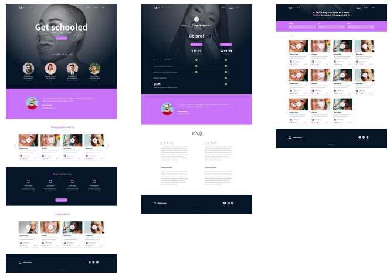

<h1 align = "center">0x0B. Implement a design with bootstrap</h1> 

    

------------

## Description
This is a visual page supposed to achieve the **0x0B. Implement a design with bootstrap** project at [Holberton School.](https://www.holbertonschool.com "Holberton School.")
In this project, you will implement 3 web pages with Bootstrap. You will use all HTML/CSS/Accessibility/Responsive design/Bootstrap knowledges that you learned previously.
You won’t have a lot of instruction, you are free to implement it the way that you want - the objective is simple: Have fully functional web pages that look the same as the designer file.

------------

## Requirements

- You have to use Bootstrap
- Your styles.css must be as small as you can - you must use as much as you can Bootstrap classes

------------

## Usage:

This is a visual website which does not have backend functionallity. In order to get the final product please download this repository and open any html file. 

------------

## Views:

    

------------

## Author:

- *Nicolás Zárate*  - [@Nicolanz](https://github.com/Nicolanz)
